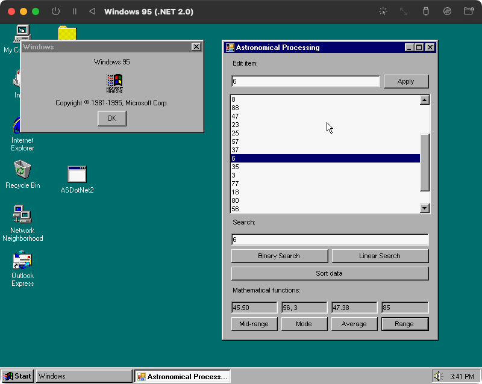

# AS-DotNet2

[Astronomical Processing](https://github.com/SMTAFE-AndrewToplass/AstronomicalProcessing/), but for .Net 2.0.

With the [.Net 2.0 backport](https://github.com/itsmattkc/dotnet9x) to Windows 95 by [MattKC](https://github.com/itsmattkc), revealed in his latest [YouTube video](https://www.youtube.com/watch?v=CTUMNtKQLl8), this program can run on version of Windows as old as Windows 95!

